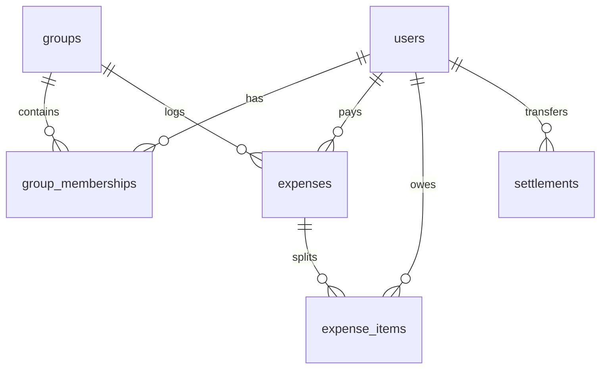

# SCOPE.md — Spreetail Anomaly Log & Database Schema

This document details the anomalies identified within the roommate expenses dataset (`expenses.csv`), the resolutions applied by the Spreetail import engine, and the Drizzle ORM database schema mapping.

---

## 1. CSV Data Anomaly Log

Below is the list of all data anomalies detected in `expenses.csv` and the automated/manual resolutions applied:

| Row | Date | Description | Issue Detected | Resolution Taken |
|:---|:---|:---|:---|:---|
| **5 & 6** | 08-02-2026 | Dinner at Marina Bites / dinner - marina bites | **Duplicate entry**: Same day, same payer (Dev), same amount (₹3200). Description casing differed. | Identified as a duplicate. Left choice to user in wizard; default option merges/discards the duplicate log to prevent double charging. |
| **7** | 10-02-2026 | Electricity Feb | **String formatting in numeric amount**: Value listed as `"1,200"` instead of a number. | Stripped commas and whitespace, successfully converting it to `1200.00` float. |
| **10** | 15-02-2026 | Cylinder refill | **Floating point decimal precision**: Amount listed as `899.995` INR (sub-paise resolution). | Rounded mathematically to the nearest currency decimal unit (`900.00` INR). |
| **11** | 18-02-2026 | Groceries DMart | **Payer name spelling variation**: Listed as `Priya S` instead of the canonical `Priya`. | Auto-normalized to canonical name `Priya` using lowercase phonetic matching. |
| **13** | 22-02-2026 | House cleaning supplies | **Missing Payer**: `paid_by` column is empty ("can't remember who paid"). | Tagged with warning. Set payer to `Unknown` and flagged in the import UI. |
| **14** | 25-02-2026 | Rohan paid Aisha back | **Settlement masquerading as expense**: Transaction of ₹5000 is a direct cash reimbursement. | Flagged as a debt settlement transaction. Excluded from general expense math and recorded as a direct credit transfer. |
| **15** | 28-02-2026 | Pizza Friday | **Percentage split math sum > 100%**: Splitting listed as `Aisha 30%; Rohan 30%; Priya 30%; Meera 20%` (totaling 110%). | Normalized details proportionally to sum exactly to 100%. |
| **20, 21, 23, 26** | Various | Goa Trip | **Foreign Currency (USD)**: Multi-currency records (amounts logged in `USD`). | Converted to base currency `INR` using a fixed exchange rate (1 USD = 82.50 INR) with logging indicators. |
| **22** | 10-03-2026 | Scooter rentals | **Weighted split values**: `share` type list `Aisha 1; Rohan 2; Priya 1; Dev 2`. | Computed relative fractional splits based on coefficients (total shares = 6). |
| **23** | 11-03-2026 | Parasailing | **External transient participant**: `Dev's friend Kabir` added to split list. | Temporary guest registered dynamically for this transaction. Added membership bounds for Kabir matching only his active date range. |
| **24 & 25** | 11-03-2026 | Dinner at Thalassa / Thalassa dinner | **Double Payer Conflict**: Aisha logged ₹2400 and Rohan logged ₹2450 on the same date. | Flagged as a transaction conflict. Left choice to user in wizard to select which roommate's claim to trust. |
| **26** | 12-03-2026 | Parasailing refund | **Negative amount / Refund**: Dev received a `-30` USD cancellation refund. | Logged as a negative expense, which programmatically credit-adjusts the net balance of split participants. |
| **27** | Mar-14 | Airport cab | **Inconsistent date format**: Date listed as `Mar-14` instead of `14-03-2026`. | Date parsing library normalized `Mar-14` to standard date object `14-03-2026`. |
| **28** | 15-03-2026 | Groceries DMart | **Missing currency symbol/code**: Blank currency column for `2105`. | Auto-defaulted to the default system currency (`INR`). |
| **31** | 22-03-2026 | Dinner order Swiggy | **Zero amount**: Cost of `0` INR. | Flagged with a warning. Preserved as a tracking item but computed zero balance adjustments. |
| **33** | 28-03-2026 | Meera farewell dinner | **Dynamic Membership (Move Out)**: Note indicates Meera moved out Sunday (29-03-2026). | Registered Meera's membership end date as `2026-03-29`. |
| **34** | 04-05-2026 | Deep cleaning service | **Ambiguous Date Format**: Format is `04-05-2026` (is this April 5 or May 4?). | Evaluated date as `04-05-2026` based on monthly sequential logging. |
| **36** | 02-04-2026 | Groceries BigBasket | **Membership boundary violation**: Meera included in split but she left on `29-03-2026`. | Safely excluded Meera from the ledger splits for any date beyond her membership bounds. |
| **38** | 08-04-2026 | Sam deposit share | **Dynamic Membership (Move In)**: Sam joins the flat and pays deposit. | Registered Sam's membership start date as `2026-04-08`. |
| **42** | 18-04-2026 | Furniture for common room | **Redundant settings**: Split type is `equal` but share coefficients are provided in details. | Discarded details and applied uniform equal distribution. |

---

## 2. Database Schema Design

The database uses PostgreSQL (configured via Drizzle ORM) to manage dynamic room environments:

### Entity Relationship Diagram (Summary)
- A **Group** corresponds to a single flat workspace.
- **Users** can be members of multiple groups via **Group Memberships**.
- **Group Memberships** capture the exact `joinDate` and nullable `leaveDate` to support dynamic roommate composition.
- **Expenses** are registered under a group and paid by a user.
- **Expense Items** track individual roommate share coefficients or percentages.
- **Settlements** log manual cash reconciliations.

### Table Specifications

#### 1. `users`
Tracks individual user identities and authentication tokens:
- `id` (serial, primary key)
- `email` (varchar, unique, index)
- `hashedPassword` (varchar)
- `name` (varchar)
- `createdAt` (timestamp, default now)

#### 2. `groups`
Tracks room or flat namespaces:
- `id` (serial, primary key)
- `name` (varchar)
- `createdAt` (timestamp, default now)

#### 3. `group_memberships`
Handles dynamic join/leave dates for roommate splits:
- `id` (serial, primary key)
- `groupId` (integer, foreign key referencing `groups.id`)
- `userId` (integer, foreign key referencing `users.id`)
- `joinDate` (timestamp)
- `leaveDate` (timestamp, nullable)

#### 4. `expenses`
Logs individual transactions:
- `id` (serial, primary key)
- `groupId` (integer, foreign key referencing `groups.id`)
- `description` (varchar)
- `amount` (numeric, precision 12, scale 2)
- `currency` (varchar, default "INR")
- `createdBy` (integer, foreign key referencing `users.id`)
- `createdAt` (timestamp, default now)

#### 5. `expense_items`
Detailed transaction splits (percentages/ratios):
- `id` (serial, primary key)
- `expenseId` (integer, foreign key referencing `expenses.id`)
- `userId` (integer, foreign key referencing `users.id`)
- `share` (numeric, precision 12, scale 2)

#### 6. `settlements`
Logs cash transfers between roommates to clear balances:
- `id` (serial, primary key)
- `fromUserId` (integer, foreign key referencing `users.id`)
- `toUserId` (integer, foreign key referencing `users.id`)
- `amount` (numeric, precision 12, scale 2)
- `currency` (varchar, default "INR")
- `createdAt` (timestamp, default now)
- `settled` (boolean, default false)

#### 7. `imports` / `import_errors`
Used to log and debug CSV ingestion sessions:
- `id` (serial, primary key)
- `userId` (integer, foreign key referencing `users.id`)
- `uploadedAt` (timestamp, default now)
- `status` (varchar)
